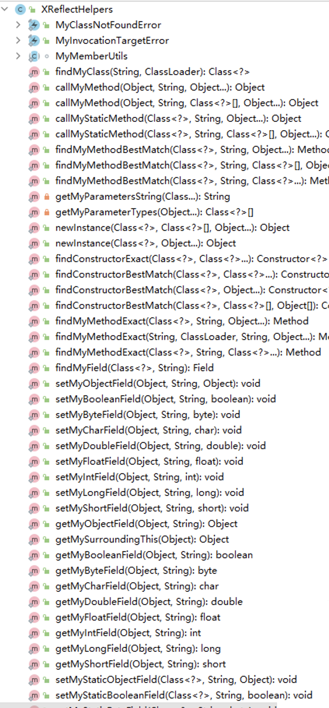

# 统一接入源
```groovy
maven { url 'https://jitpack.io' }
```
# 最新版本
[](https://jitpack.io/#Humenger/androidlib)
# 接入RSharedPreferences
- 解决`MODE_WORLD_WRITEABLE no longer supported`问题

```groovy
implementation 'com.github.Humenger.androidlib:RSharedPreferences:{latest_version}'
```
# 使用RSharedPreferences
```java
RSharedPreferences.getSharedPreferences(context,name,mode);
RSharedPreferences.getSharedPreferences(getPreferenceManager());
```
#### 包裹方式使用
```java
RSharedPreferences.sharedPreferencesBypass(getContext(), (RBypassCallback<Void>) () -> {
                setPreferencesFromResource(R.xml.root_preferences,rootKey);
                return null;
            });
```
```java
//带回调
SharedPreferences preferences= RSharedPreferences.sharedPreferencesBypass(getContext(), (RBypassCallback<SharedPreferences>) () -> 
                    getPreferenceManager().getSharedPreferences());
```
# 接入XReflectHelpers
- 移植Xposed的反射库，可以在任何APP中使用，就相当于一个普通的反射库
```groovy
implementation 'com.github.Humenger.androidlib:XReflectHelpers:{latest_version}'
```
# 使用XReflectHelpers
```java
XReflectHelpers.XXXX();
```
### api列表
 

# 接入HSystemHelpers
- 一些系统辅助类
```groovy
 implementation 'com.github.Humenger.androidlib:HSystemHelpers:{latest_version}'
```
# 使用HSystemHelpers
```java
//根据class名字查找其对应的系统jar所在路径
HSystemHelpers.findSystemJarPathWithClassName("android.app.Activity");
//获取当前进程名，目测支持android4-最新系统版本
HSystemHelpers.getProcessName(context);
//获取已加载的so库列表
HSystemHelpers.getLoadSoLibrary(onlyApp);
```
# 接入Httposed(开发中)
- 以Xposed思维设计Http拦截框架
```groovy
 implementation 'com.github.Humenger.androidlib:Httposed:{latest_version}'
```
# 接入GithubProxyHelpers
- 处理github国内无法访问问题，可以不用配置代理，快捷访问github
```groovy
 implementation 'com.github.Humenger.androidlib:GithubProxyHelpers:{latest_version}'
```
# 使用GithubProxyHelpers
```java
//初始化 可以放在Application.onCreate()函数里  
GithubProxyHelpers.init(context);
```
```java
GithubProxyHelpers.getProxyUrl("https://raw.githubusercontent.com/xxxx")
```

# 接入MiniBrowser
- 让App内置一个迷你浏览器
```groovy
 implementation 'com.github.Humenger.androidlib:MiniBrowser:{latest_version}'
```
# 使用MiniBrowser
```xml
    <com.github.Humenger.mininrowser.MiniBrowser
        android:id="@+id/mini_browser"
        android:layout_width="match_parent"
        android:layout_height="match_parent" />
```

```java
MiniBrowser browser = findViewById(R.id.mini_browser);
browser.loadUrl("https://baidu.com/");
```

# 接入multi-level-listview

- 多级菜单

```groovy
 implementation 'com.github.Humenger.androidlib:multi-level-listview:{latest_version}'
```

# 使用multi-level-listview

# 接入LogLite
- 简单Log工具

```groovy
 implementation 'com.github.Humenger.androidlib:LogLite:{latest_version}'
```

# 使用LogLite

```java
LogLite.tag("xx").i(format,args...);
```

# 接入MultiDexHook

- Xposed下多dex Hook工具

```groovy
implementation 'com.github.Humenger.androidlib:MultiDexHook:{latest_version}'
```

# 使用MultiDexHook

```java
//初始化
MultiDexHook.getInstance().init();
//注册类加载器监听器，会回调所有拦截到的classLoader
        MultiDexHook.getInstance().register((classLoader)->{});

```

# 接入FrpHelper

- 一个Android端Frp封装库

```groovy
implementation 'com.github.Humenger.androidlib:FrpHelper:{latest_version}'
```

# 使用FrpHelper

```java
FrpHelper.with(VERSION_0_42_0).startClientFormAssetsConfig(context,"frpc.ini");
```

# 接入AndroidHideApi

- 方便调用系统隐藏api

```groovy
compileOnly 'com.github.Humenger.androidlib:FrpHelper:{latest_version}'
```

> 注意：这里应使用compileOnly(仅用于通过编译)方式导入

# 使用AndroidHideApi

```java
IBinder binder=ServiceManager.getService(NETWORKMANAGEMENT_SERVICE);
```

# 致谢 Thanks


* 感谢[jetbrains公司](https://www.jetbrains.com)
  提供的[免费开源许可证](https://jb.gg/OpenSourceSupport)帮助我更好的开发本开源库
* Thanks to [jetbrains company](https://www.jetbrains.com) for
  the [free open source license](https://jb.gg/OpenSourceSupport) for helping me to better develop
  this open source library.